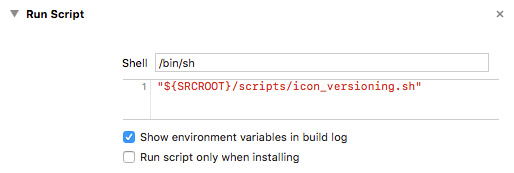
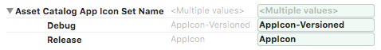
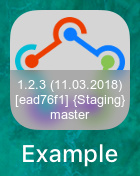

# icon_versioning plugin

[](https://rubygems.org/gems/fastlane-plugin-icon_versioning)
[](https://travis-ci.org/revolter/fastlane-plugin-icon_versioning)

## Getting Started

This project is a [_fastlane_](https://github.com/fastlane/fastlane) plugin. To get started with `fastlane-plugin-icon_versioning`, add it to your project by running:

```bash
fastlane add_plugin icon_versioning
```

## About icon_versioning

Overlay build information on top of your app icon. Based on original work by Krzysztof Zabłocki (https://github.com/krzysztofzablocki/Bootstrap).

### Improvements

Over the original implementation by Krzysztof, I also added:
- automatic font scaling and blur spreading that ensures a consistent look between different sized icons
- text lines preservation that doesn't break long lines to prevent unexpected results
- possibility to specify custom text, band height, blur spread that remain responsive to the icon sizes

### Integrating

This copies the specified `.appiconset` folder to a new folder named `OriginalName-Versioned.appiconset` and overlays the specified `text` over the icon images inside it.

To automatically run this on every build, you can add a new `Run Script` `Build Phase` before the `Compile Sources` one and point it to a script that calls this plugin:



_(Having a script file instead of the actual plugin call makes it easier to debug, change and review it, as explained in [this article](http://www.mokacoding.com/blog/better-build-phase-scripts/))_

```sh
#!/usr/bin/env bash

# optional, to prevent versioning for release builds
if [[ $CONFIGURATION == "Release" ]]; then
    exit 0
fi

# optional, to fix fastlane warnings that show up in the Report navigator
export LC_ALL=en_US.UTF-8
export LANG=en_US.UTF-8

# make sure Bundler is found
export GEM_HOME=~/.gems
export PATH=$PATH:$GEM_HOME/bin

export FASTLANE_DISABLE_COLORS=1 # optional, to remove from the build log the ANSI escape sequences that enables colors in terminal
export FASTLANE_SKIP_UPDATE_CHECK=1 # optional, to make sure that the versioning finishes as fast as possible in case there is an available update
export FASTLANE_HIDE_GITHUB_ISSUES=1 # optional, to make sure that the versioning finishes as fast as possible in case the plugin crashes

bundle exec fastlane run icon_versioning appiconset_path:'/path/to/AppIcon.appiconset' text:'1.2.3 (11.03.2018)\n[ead76f1] {Staging}\nmaster'
```

In order for the new versioned icon to be actually used by the app, you have to point the `Asset Catalog App Icon Set Name` (`ASSETCATALOG_COMPILER_APPICON_NAME`) build setting to this new versioned one:



Lastly, you should ignore the `-Versioned` folders using:

```ini
/path/to/*-Versioned.appiconset/*
```

In the end, it should look like this:



## Example

Check out the [example `Fastfile`](fastlane/Fastfile) to see how to use this plugin. Try it by cloning the repo, running `fastlane install_plugins` and `bundle exec fastlane test`.

## Run tests for this plugin

To run both the tests, and code style validation, run

```
rake
```

To automatically fix many of the styling issues, use
```
rubocop -a
```

## Issues and Feedback

For any other issues and feedback about this plugin, please submit it to this repository.

## Troubleshooting

If you have trouble using plugins, check out the [Plugins Troubleshooting](https://docs.fastlane.tools/plugins/plugins-troubleshooting/) guide.

## Using _fastlane_ Plugins

For more information about how the `fastlane` plugin system works, check out the [Plugins documentation](https://docs.fastlane.tools/plugins/create-plugin/).

## About _fastlane_

_fastlane_ is the easiest way to automate beta deployments and releases for your iOS and Android apps. To learn more, check out [fastlane.tools](https://fastlane.tools).
